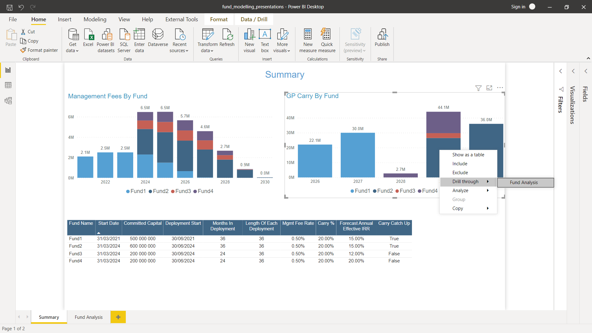
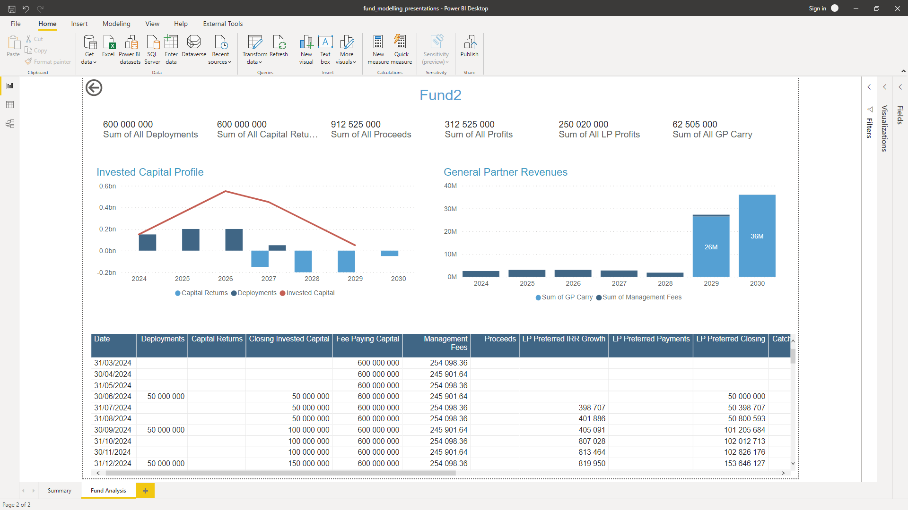
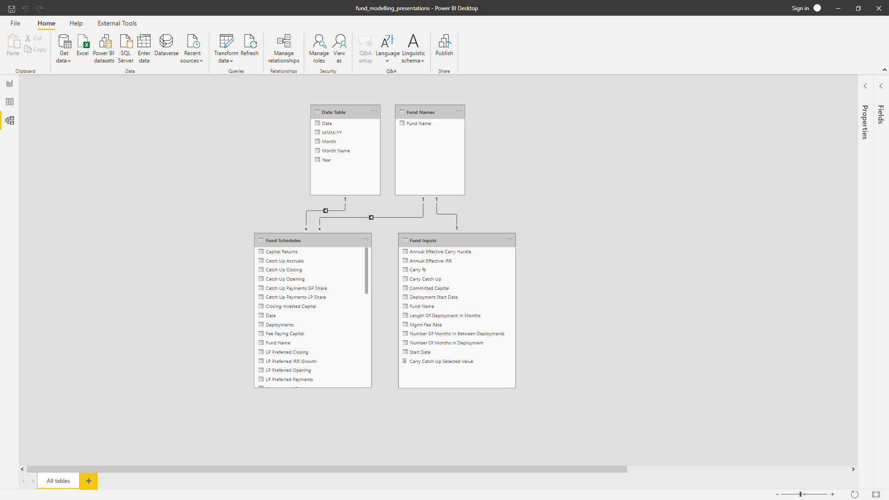

# Closed End Fund Modelling For A Private Equity Business

This repository explores how one could use Python and Power BI to both forcast and present closed ended private equity fund models, with a focus on the management and performance fees that flow to the general partner.

## Work Flow

Under the fund_models directory, a ClosedEndFund class is written in fund_models.py that utilises a number of utility date functions imported from date_utils.py which is a module that sits alongside.

A jupyter notebook (fund_class_demonstration_notebook.ipynb) is included in the repository to demonstrate instantiation of a fund object, error checking, fund attributes and fund methods.

run_scenarios.py imports this class and instantiates a number of forecast funds, whereafter fund data is written to three separate files under power_bi_datasets: 
1. fund_inputs.csv - commited capital, management fee rate, etc.
2. fund_schedules.csv - deployments, invested capital, management fees, etc.
3. path_for_power_bi.txt - the import path for Power BI (Power BI does not support relative imports)

Power BI reads in these CSVs, set's up a data model that is as small as it gets: two fact tables, a date table and a fund dimension table (comprised of fund name only).

Some simple DAX formulas were authored with Tabular Editor for presentation of two reports:
1. The first graphs management fees and carry. A table of fund assumptions is also included.
2. The second graphs invested capital and revenues, filterable by fund. A summary table that presents the breakdown of all fund cashflows is also included. This second report is accessible via a drill on the first report.

## Some thoughts

I have managed these sorts of fund models in Excel at work. At the start Excel feels quicker and easier. By the end it's Python that feels that way, with Excel rather unwieldy!

Tabular Editor is really nice to work with, wow! It's such a pleasure compared to the native Power BI editor.

Json themeing in Power BI is great and it is worthwhile investing a little time working on one for import across your projects. I still need to work on one that looks really good, but the one I did use saved me quite a bit of time getting visuals into a more presentable state.

There is much further to go in the object orientated approach. Creating a Deployments class would seem to me the most obvious next step. Ultimately each deployment would represent an asset that would have a custom return profile and history.

I smiled at the ridiculousness of my little hack to set up what is effectively a relative import in the Power BI file, as relative imports are not supported. I used Python to write the current working directory to a text file, which is then read in by Power BI and used to construct the import paths in the queries (after having adjusted privacy settings to circumnavigate the formula.firewall error - ha!) 

## Power BI Report Screenshots

